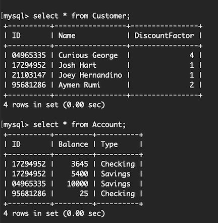

## Bank-Application

A **Banking Application** I made, allowing the **App User** to create **Customer profiles** and **Account profiles** for given customers, only allowing 2 Accounts per Customer(**Checking & Savings**) where **Withrdawals,Deposits, & Transfers_** are allowed. Data is saved in a **MySQL Database**, **Driver.java** allows an interface for the user to interact with the **Database**. I programmed a **Graphical User Interface(GUI)** using **Java Swing** that allows the user to use the Application with ease

